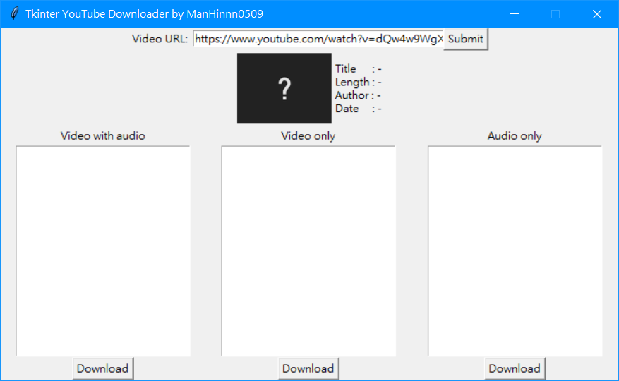
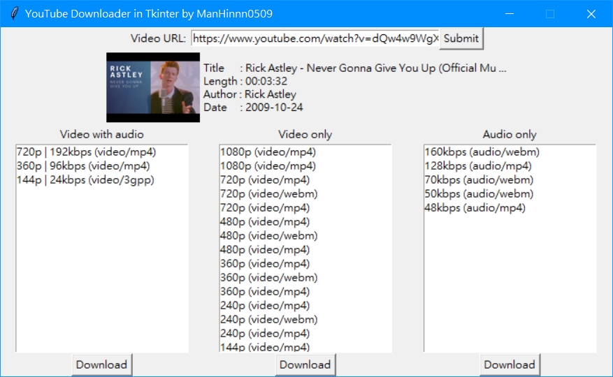
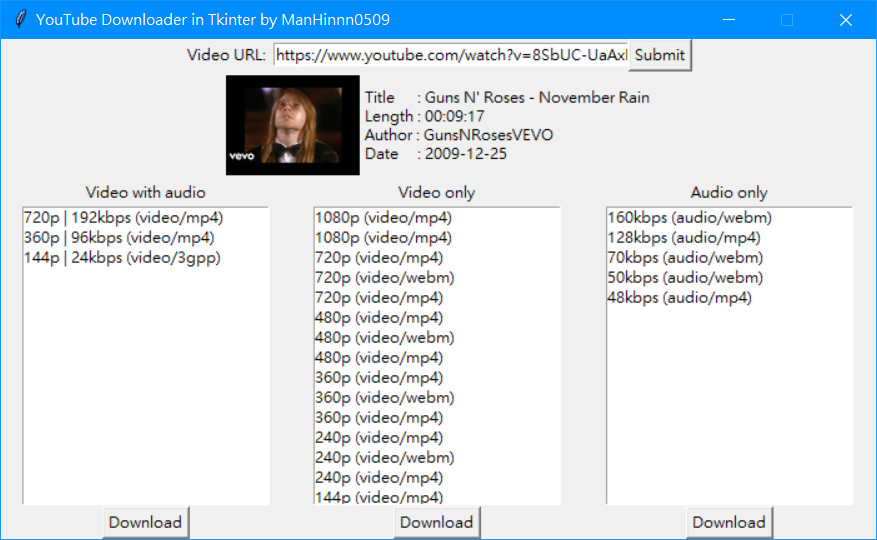

# tk-yt-downloader

A YouTube downloader in Tkinter

P.S: The GUI may not look good since I don't really have a good art sense. Sorry!

## How to use?

1) Paste the video url into the input field on the top of the window
2) Press the "Submit" button
3) Wait for the program to load
4) Click to select the stream you want to download
5) Press the "Download" button under the listbox

## Merging the download parts (Video & audio)

You can merge them by the following command (simplest way):

```
ffmpeg -i video.mp4 -i audio.wav -c:v copy -c:a aac output.mp4
```

Change `video.mp4`, `audio.wav`, and also `output.mp4` to your file names

## Requirements

See [requirements.txt](./requirements.txt)

Also, [FFmpeg](https://github.com/FFmpeg/FFmpeg) is needed if for merging video & audio parts

## Demo

* Launch up



* Result





## Planned

* [ ] Best quality stream download button
    * [ ] Video
    * [ ] Audio
* [ ] Merge button (Merge video & audio)
* [ ] Create `.exe` builds
* [x] [Optional output path](https://github.com/ManHinnn0509/tk-yt-downloader/commit/69ecfc142d82d5ada2cc9429a0a1624b992b4ed8)
* [x] [Maximum title display length](https://github.com/ManHinnn0509/tk-yt-downloader/commit/b9ca71bd3ba68379bfba92f49a93a23b6f8b6605)
* [x] [Sort streams by it's quality (Highest to lowest)](https://github.com/ManHinnn0509/tk-yt-downloader/commit/b9ca71bd3ba68379bfba92f49a93a23b6f8b6605)
<<<<<<< HEAD
=======

## Disclaimer

This program should only be used on **non-copyrighted** material.
>>>>>>> 8b748b4955b9a6d75f7ac15cf3961297caeac988
